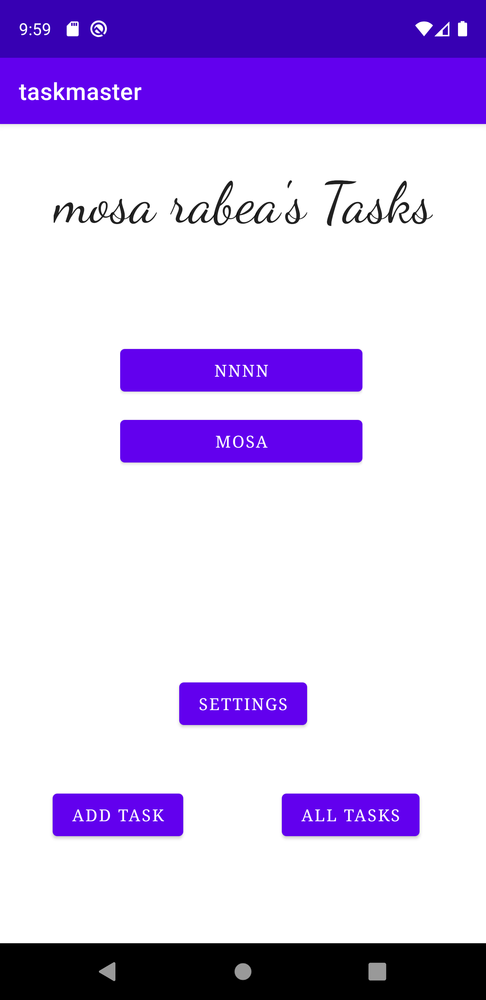
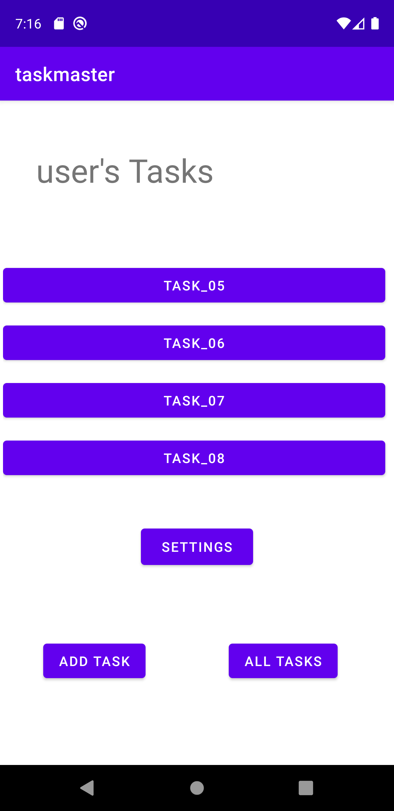
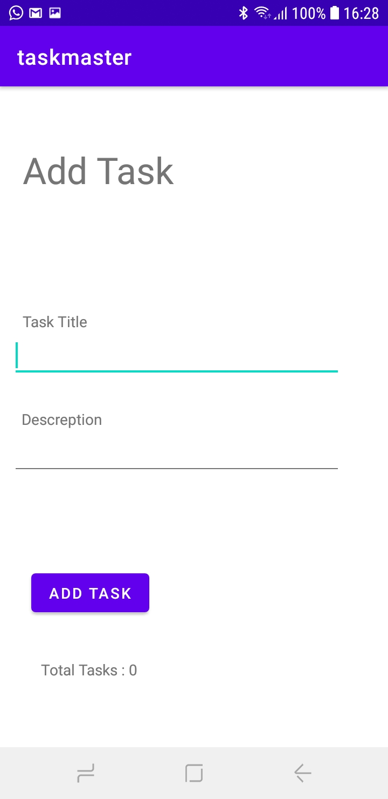
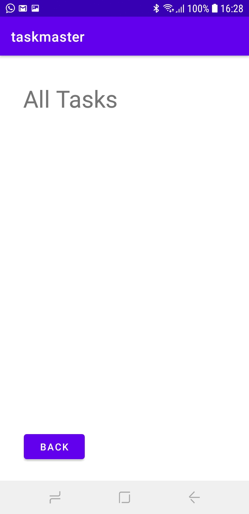
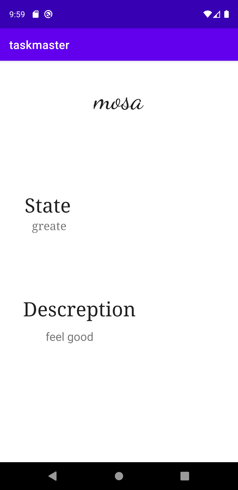

# taskmaster

## changes for today : lab26 =>{

* create a home page which has a three tasks buttons and settings button and (add task , all tasks) buttons.
* create an add task page which has two fields (title , descreption)  .
* add buttons which shows a message of submitted.
* create an all tasks page which has an image .
* create a back button to navigate you back to the home page.

## changes for today : lab27 :

* add a task details page which shows the task title and the descreption.

* add a setting page which the user can change his username from there.

## changes for today : lab28 :

* add a recycle view to show the tasks dynamically in home page. 

## changes for today : lab28 :

* a data base added, the data now is stored in the database.

* added a click functionality on the tasks on main page to navigate you to task details page.

* when adding a new task from add task page the task will be stored in the data base.

# Home page with Room:

# Home page with Recycle View1:

# Home page with Recycle View1:

# Add Task page :

# All Task page :

# settings page :

# Task details page :

# }
