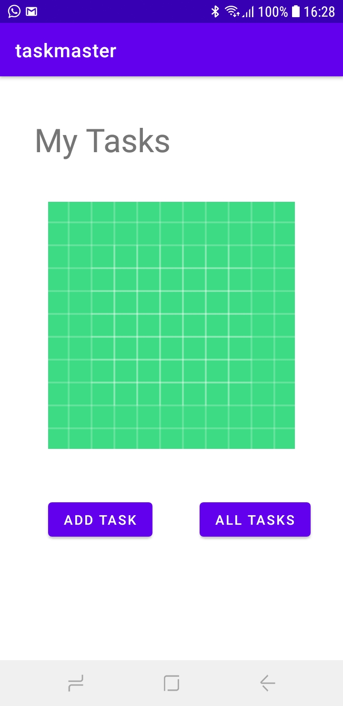

# taskmaster

## changes for today : lab26 =>{

* create a home page which has a three tasks buttons and settings button and (add task , all tasks) buttons.
* create an add task page which has two fields (title , descreption)  .
* add buttons which shows a message of submitted.
* create an all tasks page which has an image .
* create a back button to navigate you back to the home page.

# Home page :

# Add Task page :

# All Task page :

# }
